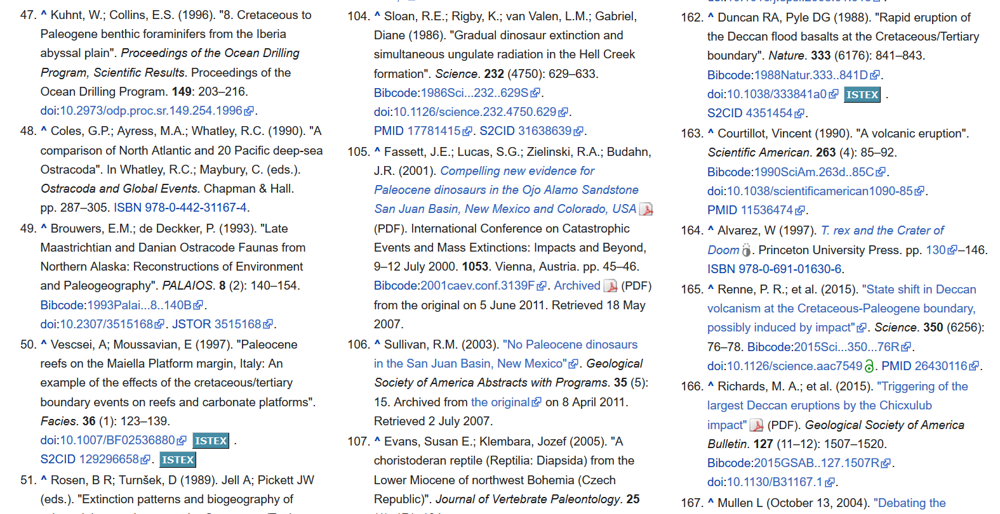
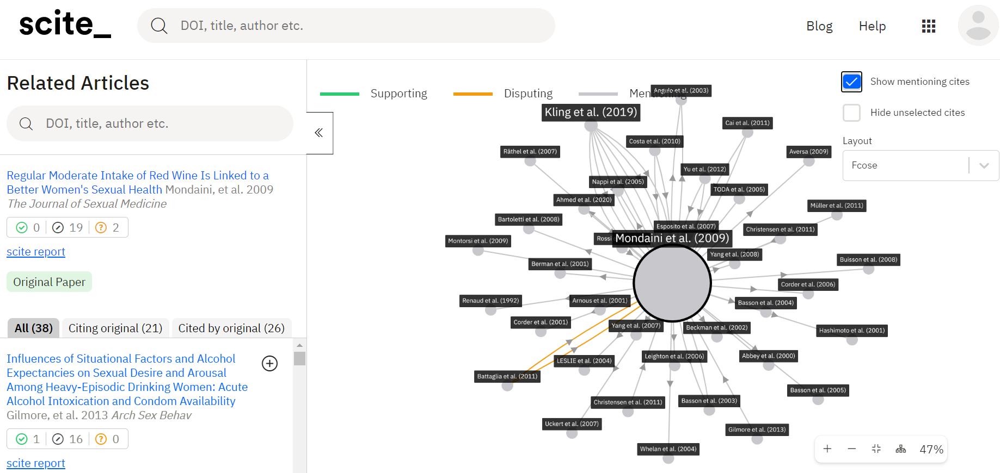

# Quel navigateur ?

Pas de préférence pour le travail académique : Firefox ou Chrome compatibles tous deux avec Zotero
Si la recherche porte sur un sujet sensible et requiert l'anonymat, essayer Tor.

# Quel moteur de recherche dans son navigateur ?

[Duckduckgo](https://duckduckgo.com) est un métamoteur qui interroge entre autres Google et Bing, mais sans laisser de log chez l'un ou l'autre. L'outil ne retient pas votre historique de recherches, cela vous permet d'échapper à la bulle de filtre. Surtout, l'outil vous permet d'obtenir très vite des résultats d'autres sources voire d'autres moteurs de recherche comme Google ou Pubmed, quand les résultats de Duckduckgo ne sont pas assez spécifiques. C'est à ça que servent les *!bangs*. Attention toutefois, quand on utilise un !bang, on sort de DDG et on n'est plus couvert par l'aspect confidentiel du métamoteur.

!pubmed : interroge pubmed
!mesh : langage documentaire mesh (utilisé dans Pubmed)
!g , !gimages , !gnews : google search, google images, google news
!w , !wen : wikipédia, wikipédia anglophone
!sudoc : système universitaire de documentation (SUDOC)
etc. voir sur le [site de DDG](https://duckduckgo.com/bang?) tous les !bangs qui existent

Ces !bangs sont des raccourcis qui vous font gagner du temps ; les extensions jouent le même rôle, vous pourriez accéder aux mêmes services par les sites webs associés mais :

- l'extension vous prévient par un pop-up que quelque chose existe ici qui pourrait vous intéresser
- vous pouvez activer par un simple bouton un service qui existe en ligne ; cela vous prendrait plus de temps pour vous rendre sur le site.

Le retour des extensions pour navigateur dans les années 2013-2014 : une façon plus simple de découvrir des textes en open access que l'interrogation d'archives ouvertes ou de google scholar par exemple.

Cela peut tout de même poser quelques problèmes de confidentialité : les extensions aux navigateurs peuvent servir à des tiers à collecter un grand nombre d'informations sur votre comportement d'internaute.

# Accéder à de la littérature scientifique (lien vers du contenu souscrit + articles en open access)

## Library access, aka Lean Library (Chrome, Firefox)

Si votre bibliothèque est abonnée à Library Access, cette extension vous permettra de faire le lien avec les abonnements électroniques de cette bibliothèque. Chaque fois que vous affichez une page sur laquelle se trouve un article accessible par l'un de ces abonnements, le pop up de Library Access vous en informe. La bibliothèque peut ausi y paramétrer des messages utiles à propos de ses services (Prêt entre bibliothèque par exemple). Par ailleurs, Library Access intègre le code libre de Unpaywall (voir ci-dessous) et permet de trouver les versions OA des articles que l'on affiche sur son navigateur.
Pour plus d'info sur Library Access, consulter la doc [sur le site](https://bibliotheques.univ-rennes1.fr/library-access) de la bibliothèque (@LiardAcceslignefacile)

## Kopernio (Chrome, Firefox)

Kopernio fait sensiblement le même travail que Library Access (moins les messages personnalisés de votre bibliothèque). Kopernio vous permet en plus de conserver des références d'articles, mais c'est peu utile quand vous utilisez Zotero pour ce faire.

On peut se demander pourquoi ces extensions sont utiles ; c'est qu'il n'est pas si facile d'accéder à la littérature scientifique à partir des sites universitaires (problématique des URL proxyfiées)

## Unpaywall (ex oadoi) ou Google Scholar Button (Chrome, Firefox)

28 millions de textes en open access à portée d'un seul clic du côté d'Unpaywall, mais il semble que le bouton de Google Scholar (Google Scholar button) soit plus efficace encore pour détecter des articles en open access, surtout s'ils ne sont pas disponibles sur des archives ouvertes mais sur des pages personnelles de chercheurs (Tay, 2018)
Le moteur de recherche d'Unpaywall est également implémenté dans Zotero

# Trouver des archives

## Istex (Firefox, Chrome)
La [plateforme ISTEX](https://www.istex.fr) donne accès à des corpus de revues scientifiques dont les numéros vont jusqu'à une date récente (située vers 2014). La liste des corpus qui ont été négociés et acquis entre 2012 et aujourd'hui pour les communautés universitaires françaises se trouve sur le site [www.licencenationale.fr](https://www.licencesnationales.fr/)
Pour télécharger l'extension, aller sur le [site d'Istex](https://addons.istex.fr/).

## Internet archive
Obsolescence importante des accès aux articles scientifiques sur le web. Une étude de 2015 dont le site Internet Actu faisait le compte rendu @Sussanwebestilencore2015 indique que :

>70 % des références données par la Harvard Law Review et d’autres journaux de droit, et 50 % des URLs pointant sur les opinions de la Cour Suprême ne fournissent pas les liens corrects vers l’information originale citée. » Par ailleurs, continue le New Yorker, une équipe de l’institut de Los Alamos a étudié plus de trois millions d’articles universitaires parus dans les domaines scientifiques médicaux et technologiques entre 1997 et 2002. Un lien sur cinq était mort.

Cela dit le bouton Internet Archive (recent version) sert à retrouver toutes sortes de pages qui ne sont plus en ligne (erreurs 404)
Le bouton "save page now" permet d'enregistrer une page dans Internet Archive.
Il y a un enjeu important ici : la plus grande partie de votre biblio possible devra rester accessible plusieurs années après la présentation de vos travaux, donc il est préférable de fournir deux types de liens plutôt qu'un seul (lien vers l'article présenté sur le site de l'éditeur commercial + lien vers l'article enregitré dans Internet Archive)

#  traitement sémantique

## Scite (firefox et Chrome)

A partir d'un traitement linguistique sur le texte des articles et des références en bibliographie, Scite fait des liens entre publications basées sur la relation (confirme, infirme, neutre) que ces publications entretiennent entre elles. Très utile pour trouver des articles qui apportent des nunances ou des éléments contradictoires par rapport à une étude donnée.
La classification est la suivante : supporting evidence / mentionning / disputing evidence
On peut visualiser un graphique qui montre comment les citations sont liées entre elles.
Essayer avec [cet article](https://science.sciencemag.org/content/359/6380/1146.abstract)

Illustration des relations entre articles mentionnant et discutant les résultats d'une [étude parue chez Elsevier](https://www.sciencedirect.com/science/article/abs/pii/S1743609515322773)

## Scholarcy (Chrome uniquement)

Scholarcy séquence l'article et réalise les opérations suivantes :

- extrait les mots-clés de l'étude
- extrait une phrase permettant de résumer l'article
- constitue un résumé de l'article de 400 mots (par défaut)
- surligne les passages importants (ceux que Scholarcy nous désigne comme tels)
- facilite l'extraction des figures (optionnel) et des tableaux (par défaut) en format image ou excel

Fonctionne difficilement sous proxy

Peut-être utile pour les revues de littérature mais pas vraiment pour importer la biblio de l'article dans Zotero @Scholarcyreferenceextraction

# Bibliographie

